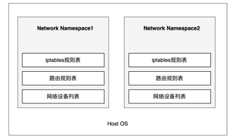
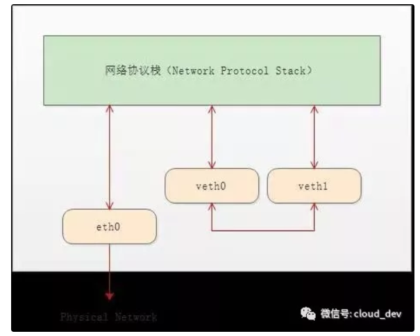
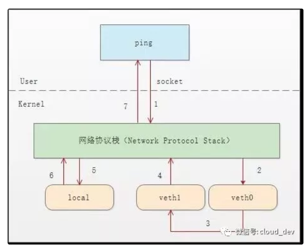
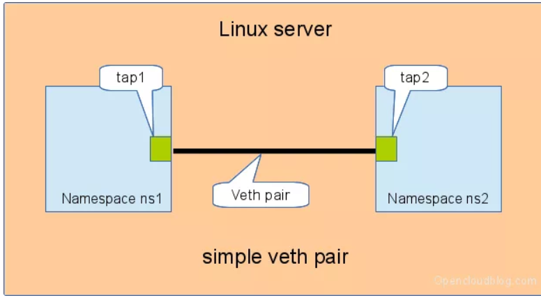
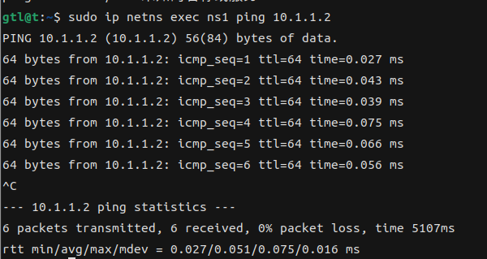
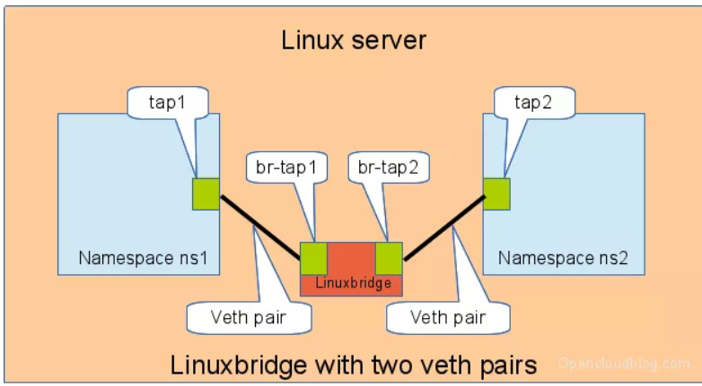

# 构建容器

## 1. 使用pivot_root 实现root文件系统的隔离

我们使用``namespace mount`` 创建了一个与主机文件系统隔离的容器进程，但是此时容器内的目录挂载是继承了主机目录挂载的。我们首先要将root 文件系统挂载到一个新的目录中。


通过``mount``无法实现``rootfs``的切换，因为我们无法使所有的进程停止使用当前``rootfs`` 。当我们使用``umount`` 卸载当前``rootfs``挂载后，进程已经无法正常提供``mount``操作支持我们挂载新的``rootfs`` 。但是可以采用另一个系统调用:``pivot_root``


**pivot_root**

```C
int pivot_root(const char *new_root, const char *put_old);
```


该函数首先将根挂载点移动到``put_old`` 目录下，然后``new_root`` 设置为新的根挂载点 。根挂载节点就会发生如下转移关系: ``/ -> put_old -> new_root`` 。第二次转移后就可以将``put_old umount``  掉。


man手册对该函数的说明：

> pivot_root()函数允许调用者切换到一个新的根文件系统，并将旧的根挂载点放置在new_root下的一个位置，从而可以随后卸载它。（它将所有具有旧根目录或当前工作目录的进程移动到新根，使得旧根挂载点可以更容易地卸载，从而释放用户。）

该函数使用较为复杂，需要注意下面几点：

• new_root和put_old必须是目录。

• new_root和put_old不能与当前根目录位于同一挂载上。

• put_old必须位于或位于new_root下；也就是说，将指向put_old的路径名后面添加一些非负数的"/.."后缀，应该得到与new_root相同的目录。

• new_root必须是一个挂载点的路径，但不能是"/"。一个尚未是挂载点的路径可以通过将该路径绑定到自身来转换为挂载点。

• new_root的父挂载的传播类型和当前根目录的父挂载的传播类型不能为MS_SHARED；类似地，如果put_old是一个现有的挂载点，则其传播类型不能为MS_SHARED。这些限制确保pivot_root()永远不会将任何更改传播到另一个挂载命名空间。

• 当前根目录必须是一个挂载点。


**go 代码实现**


```go
func pivotRoot(newroot string) error {
    
	putold := filepath.Join(newroot, "/.pivot_root")
	// 创建 rootfs/.pivot_root 存储old_root
	if err := os.Mkdir(putold, 0777); err != nil {
		return err
	}
	// 将newroot变为挂载点
	if err := syscall.Mount(
		newroot,
		newroot,
		"",
		syscall.MS_SLAVE|syscall.MS_BIND|syscall.MS_REC,
		"",
	); err != nil {
		return fmt.Errorf("Mount rootfs to itself error: %v", err)
	}
	// pivot_root 
	if err := syscall.PivotRoot(newroot, putold); err != nil {
		return fmt.Errorf("pivot_root :%v", err)
	}

	// 修改当前的工作目录
	if err := os.Chdir("/"); err != nil {
		return fmt.Errorf("chdir / %v", err)
	}
	putold = filepath.Join("/", ".pivot_root")
	if err := syscall.Unmount(putold, syscall.MNT_DETACH); err != nil {
		return fmt.Errorf("umount pivot_root dir %v", err)
	}
	return os.Remove(putold)
}

```


上面代码直接运行会报错：``invalid argument``


查看man手册可能报错原因:

>- ``EINVAL：new_root``不是一个挂载点。
>
>- ``EINVAL：put_old``不在或下面new_root。
>
>- ``EINVAL``：当前根目录不是挂载点（因为之前的``chroot(2)``）。
>
>- ``EINVAL``：当前根在``rootfs``（初始``ramfs``）挂载上；请参见NOTES。
>
>- ``EINVAL：new_root``处的挂载点或该挂载点的父挂载点具有MS_SHARED传播类型。
>
>- ``EINVAL：put_old``是一个挂载点，并且具有MS_SHARED传播类型。


错误定位到第五条。因为``Shared subtrees`` 机制，子``namespace`` 会继承主机的挂载点，挂载点的类型默认都是``shared`` ，可以参考文章: 

[Linux mount (第二部分 - Shared subtrees)](https://segmentfault.com/a/1190000006899213?utm_source=sf-similar-article)

在原先代码上增加如下代码：

```go
// 将namespace下的所有挂载点改为私有挂载点
if err := syscall.Mount("","/","",syscall.MS_PRIVATE|syscall.MS_REC,"",); err != nil {
	return fmt.Errorf("mount / private failed: %v", err)
}
```


**参考文章**

[Linux mount(第二部分 - Share subtrees)](https://segmentfault.com/a/1190000006899213?utm_source=sf-similar-article)

[C语言pivot_root 的Invalid argument错误解决方案](https://blog.csdn.net/qq_37857224/article/details/125421976)

[man手册](https://man7.org/linux/man-pages/man2/pivot_root.2.html)

[命名空间Go实现 - Mount](https://bingbig.github.io/topics/container/namespaces_in_go_mount.html#pivot-root)

[Linux mount 命令进阶](https://www.cnblogs.com/sparkdev/p/9045563.html)

<<自己动手写docker>>


# 构建虚拟网络

## 1. Network Namespace 网络隔离

Network Namespace（后续简称 netns） 是 Linux 内核提供的用于实现网络虚拟化的核心，它能创建多个隔离的网络空间，该网络空间内的防火墙、网卡、路由表、邻居表、协议栈与外部独立，不管是虚拟机还是容器，当运行在独立的命名空间时，就像是一台单独的物理主机。





## 2. 网卡设备

网卡是一个硬件设备，负责将数字信号转换成电信号，然后发送到网络当中。它会提供上下两个接口，上接口对应的是软件，也就是网络协议栈；下接口对应硬件(双绞线)，传输电信号。

每一个``netns``都有自己独立的网卡设备，当我们创建一个新``netns``时，因为它与主机的``netns``不同，并不能直接使用主机真实的网卡设备。因此刚创建的``netns``是不具备上网功能的。

既然无法使用真实的网卡设备，那么我们可以虚拟化出一个网卡设备解决这个问题。下面介绍虚拟网卡``veth``技术。


## 3. 虚拟网卡Veth


``Veth``又被称为``Veth-Peer``，它是成对出现的虚拟网卡，将这两个``veth``配置到不同的``netns``时，就可以实现网络的互通。





``veth``与真实的网卡不同，它一端连着网络协议栈，一端彼此相连。


下面说明``veth``是如何工作的

``ns0``中的``veth0 ping ns1`` 中的``veth1``(``veth1`` 和 ``veth2 ``分配的``ip``属于同一个网段)，具体流程如下：

1. ``socket`` 将``ICMP`` 命令发送给``ns0``中的网络协议栈，网络协议栈经过``TCP/IP``四层对数据进行封装。
2. 协议栈将数据交给虚拟网卡``veth0``。

3. ``veth0`` 直接将数据转发给``ns1``中的``veth1`` 。

4. ``veth1``收到数据后直接将数据交给``ns1的网络协议栈``。

5. 网络协议栈构建``ICMP Reply`` 后查看路由表，将数据发送给``localback``。
6. ``localback`` 什么也没干，直接将数据转发给网络协议栈。
7. 协议栈收到``ICMP Reply`` 将数据发送给对应的``socket``。

8. 等待在用户态的ping程序发现socket返回。




## 4. 构建不同netns间的网络连通

### 4. 1 直接相连


直接通过一对``veth`` 连接两个``netns``




```shell
# 创建两个网络命名空间
sudo ip netns add ns0
sudo ip netns add ns1

# 创建一对虚拟网卡设备
sudo ip link add veth0 type veth peer name veth1

# 将这对veth分别加入到ns中
sudo ip link set veth0 netns ns0
sudo ip link set veth1 netns ns1

# 为veth分配同网段的ip地址
sudo ip netns exec ns0 ip addr add 10.1.1.2/24 dev veth0 
sudo ip netns exec ns1 ip addr add 10.1.1.3/24 dev veth1 

# 启用两个网卡
sudo ip netns exec ns0 ip link set veth0 up
sudo ip netns exec ns1 ip link set veth1 up

# ns1 ping ns0
sudo ip netns exec ns1 ping 10.1.1.2
```


结果如下图：





## 4.2 birdge 模式


``docker`` 就是通过``veth`` 实现不同容器与主机的通信，以及容器之间的通信。但是通过上述方式实现会出现一些问题。如果需要启动十个容器，这十个容器都要实现与主机的通信，那么意味着要创建10对虚拟veth，那么主机上就会出现大量的虚拟网卡，这显然是不行的。


bridge模式在不同的netns之间引入了一个网桥(可以理解为交换机)，负责管理不同netns之间的通信。



```shell
# 创建两个网络命名空间
sudo ip netns add ns0
sudo ip netns add ns1

# 首先创建 bridge br0
sudo ip link add br0 type bridge
sudo ip link set br0 up 

# 然后创建两对 veth-pair
sudo ip link add veth0 type veth peer name br-veth0
sudo ip link add veth1 type veth peer name br-veth1

# 分别将两对 veth-pair 加入两个 ns 和 br0
sudo ip link set veth0 netns ns1
sudo ip link set br-veth0 master br0
sudo ip link set br-veth0 up

sudo ip link set veth1 netns ns2
sudo ip link set br-veth1 master br0
sudo ip link set br-veth1 up

# 给两个 ns 中的 veth 配置 IP 并启用
sudo ip netns exec ns1 ip addr add 10.1.1.2/24 dev veth0
sudo ip netns exec ns1 ip link set veth0 up

sudo ip netns exec ns2 ip addr add 10.1.1.3/24 dev veth1
sudo ip netns exec ns2 ip link ser veth1 up
```

