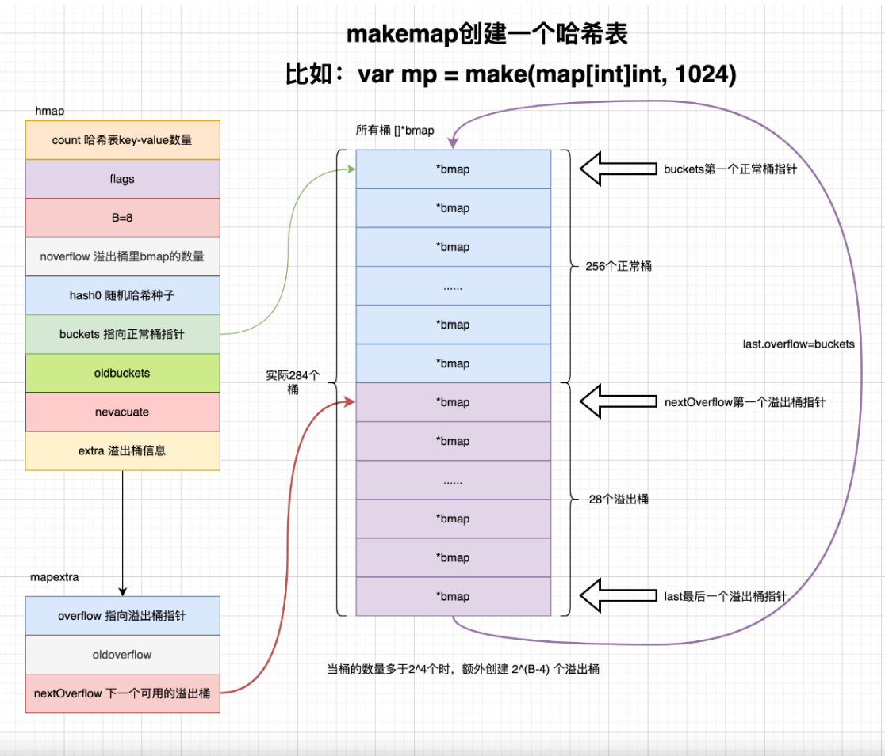
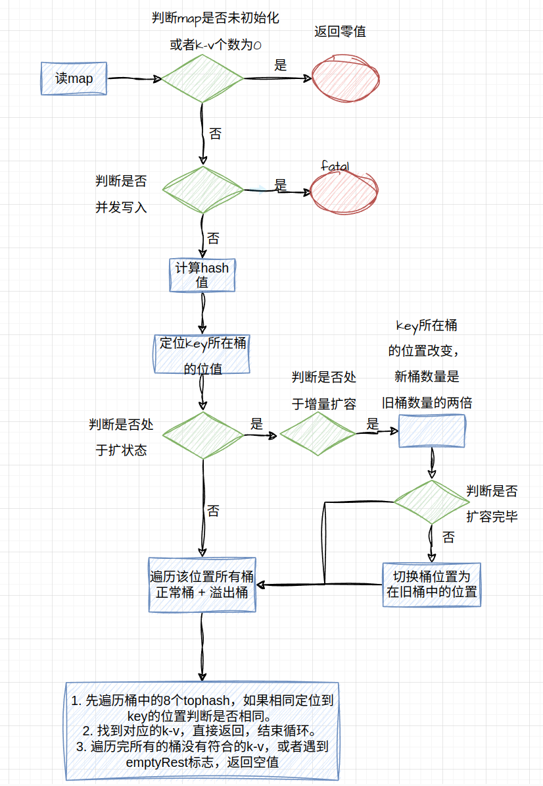

# 数据结构

```go
// A header for a Go map.
type hmap struct {
	// Note: the format of the hmap is also encoded in cmd/compile/internal/reflectdata/reflect.go.
	// Make sure this stays in sync with the compiler's definition.
	count     int // map中key-value的数量
	flags     uint8
    B         uint8  // 桶数组长度的指数，桶长度: 2^B
	noverflow uint16 // 溢出桶的数量
	hash0     uint32 // hash种子，在计算hash值的时候会被用到

	buckets    unsafe.Pointer // 指向哈希桶数组的指针
	oldbuckets unsafe.Pointer // 扩容过程中指向旧桶数组的指针，用于解决扩容过程中的读操作
	nevacuate  uintptr        // 扩容时的进度标识

	extra *mapextra // 预申请的溢出桶，防止在用户调用的时候才去申请空间
}
```


# 创建map


## makemap

```go
func makemap(t *maptype, hint int, h *hmap) *hmap {
    // 判断预分配的容量是否溢出或者超过了最大容量
    //MulUintptr函数会计算两个参数的乘积，并判断是否溢出，未溢出会将乘积返回
    //t.bucket.size 表示map内部数据结构的大小
	mem, overflow := math.MulUintptr(uintptr(hint), t.bucket.size)
	if overflow || mem > maxAlloc {
		hint = 0
	}
	// initialize Hmap
	if h == nil {
		h = new(hmap)
	}
    // 生成随机的hash因子
	h.hash0 = fastrand()
    
    // 寻找不大于负载因子情况下最小的bucket数组大小
	B := uint8(0)
	for overLoadFactor(hint, B) {
		B++
	}
	h.B = B

	// 初始化桶数组和备用溢出数组
    // B == 0 时采取lazy init的方法
	if h.B != 0 {
		var nextOverflow *bmap
        // 根据内部数据结构t和buctet数组大小 2^B 来创建bucket数组和预申请的溢出数组
		h.buckets, nextOverflow = makeBucketArray(t, h.B, nil)
		if nextOverflow != nil {
			h.extra = new(mapextra)
			h.extra.nextOverflow = nextOverflow
		}
	}

	return h
}
```


## overLoadFactor

```go
const loadFactorNum = 13
const loadFactorDen = 2
const goarch.PtrSize = 8
const bucketCnt = 8

// 该函数检查count个key-value放入到2^B桶时，是否overload 
func overLoadFactor(count int, B uint8) bool {
    /*
    1. key-value个数小于8个，不算overload
    2. key-value个数小于桶数量的6.5倍时不算overload
    */
    return count > bucketCnt && uintptr(count) > loadFactorNum*(bucketShift(B)/loadFactorDen)
}


// 数据安全(不会溢出)的位移运算
// 在64位操作系统下就是：uintptr(1) << (b & 63)
func bucketShift(b uint8) uintptr {
    return uintptr(1) << (b & (goarch.PtrSize*8 - 1))
}
```


map 预分配容量、桶数组长度指数、桶数组长度之间的关系如下表：

| **kv 对数量**             | **桶数组长度指数 B** | **桶数组长度 2^B** |
| ------------------------- | -------------------- | ------------------ |
| 0 ~ 8                     | 0                    | 1                  |
| 9 ~ 13                    | 1                    | 2                  |
| 14 ~ 26                   | 2                    | 4                  |
| 27 ~ 52                   | 3                    | 8                  |
| 2^(B-1) * 6.5+1 ~ 2^B*6.5 | B                    | 2^B                |


## makeBucketArray


```go
func makeBucketArray(t *maptype, b uint8, dirtyalloc unsafe.Pointer) (buckets unsafe.Pointer, nextOverflow *bmap) {
	// 要分配的基础桶大小
    base := bucketShift(b)
	nbuckets := base
	// 对于桶数量小于2^4 的认为不太可能会用到溢出桶
	if b >= 4 {
        // 增加2^(b-4) 个溢出桶
		nbuckets += bucketShift(b - 4)
		sz := t.bucket.size * nbuckets
        // 内存向上对齐
		up := roundupsize(sz)
		if up != sz {
			nbuckets = up / t.bucket.size
		}
	}
    // 创建桶，正常桶和溢出桶在内存空间中是连续的
	buckets = newarray(t.bucket, int(nbuckets))
	// 存在溢出桶
    if base != nbuckets {
        // 让nextflow指针指向溢出桶的起始位置
		nextOverflow = (*bmap)(add(buckets, base*uintptr(t.bucketsize)))
        // 让最后一个溢出桶的last指针指向正常桶的起始位置
		last := (*bmap)(add(buckets, (nbuckets-1)*uintptr(t.bucketsize)))
		last.setoverflow(t, (*bmap)(buckets))
	}
	return buckets, nextOverflow
}
```


这个方法有一个有趣的地方：它会将最后一个溢出桶的nextOverflow指向正常桶，而其他溢出桶的nextOverflow都为空。这种方式可以通过指针碰撞的方式来判断是否有空闲的溢出桶。详情可以看写入操作部分的newoverflow方法。





# 读取流程


## mapaccess1


```go
func mapaccess1(t *maptype, h *hmap, key unsafe.Pointer) unsafe.Pointer {
    // ......
    // hmap为nil或这是空map
	if h == nil || h.count == 0 {
		if t.hashMightPanic() {
			t.hasher(key, 0) // see issue 23734
		}
        // 返回零值
		return unsafe.Pointer(&zeroVal[0])
	}
    // 该map正在并发写入
	if h.flags&hashWriting != 0 {
		throw("concurrent map read and map write")
	}
    // 计算出hash值
	hash := t.hasher(key, uintptr(h.hash0))
    // 2^B - 1，用于下面计算桶位置
    // &m 相当于 %(m+1)
	m := bucketMask(h.B)
    // 定位数据所在桶在buckets中的位置
	b := (*bmap)(add(h.buckets, (hash&m)*uintptr(t.bucketsize)))
    // oldbuckets不为nil，说明hmap正在扩容
	if c := h.oldbuckets; c != nil {
        //正在增量扩容
		if !h.sameSizeGrow() {
			// 增量扩容情况下，就桶数量是新桶数量的一半
			m >>= 1
		}
        // 定位数据所在桶在oldbuckets中的位置
		oldb := (*bmap)(add(c, (hash&m)*uintptr(t.bucketsize)))
        // 数据没有迁移完毕，应该在旧桶中读数据
		if !evacuated(oldb) {
			b = oldb
		}
	}
    // 64位下，tophash是hash的高8位
	top := tophash(hash)
bucketloop:
    // 遍历b处的所有bmap桶：1个正常桶和多个溢出桶
	for ; b != nil; b = b.overflow(t) {
        // 遍历一个bmap中的8个tophash
		for i := uintptr(0); i < bucketCnt; i++ {
            // tophash不同，key一定不同
			if b.tophash[i] != top {
                // 该hmap后面都为nil，不需要再遍历，key不存在
				if b.tophash[i] == emptyRest {
					break bucketloop
				}
				continue
			}
            //tophash相同，key可能相同，定位到该tophash对应的key的位置
			k := add(unsafe.Pointer(b), dataOffset+i*uintptr(t.keysize))
			if t.indirectkey() {
				k = *((*unsafe.Pointer)(k))
			}
            // key 相同
			if t.key.equal(key, k) {
                // 定位到value的位置
				e := add(unsafe.Pointer(b), dataOffset+bucketCnt*uintptr(t.keysize)+i*uintptr(t.elemsize))
				if t.indirectelem() {
					e = *((*unsafe.Pointer)(e))
				}
				return e
			}
		}
	}

```


## evacuated

```go
const (
	// tophash可能保留的标记位
    // tophash除开这五个数外，都表示key的高八位hash值
	emptyRest      = 0 // 此单元格为空，并且在更高的索引或溢出处没有更多的非空单元格。
	emptyOne       = 1 // 此单元格为空。
	evacuatedX     = 2 // 键/元素是有效的。 条目已被撤离到较大表的前半部分。
	evacuatedY     = 3 // 与上述相同，但已撤离到较大表的后半部分。
	evacuatedEmpty = 4 // 单元格为空，桶已被撤离。
	minTopHash     = 5 // 正常填充单元格的最小tophash值。
)

// hash值为2,3,4中的一个状态表示
func evacuated(b *bmap) bool {
	h := b.tophash[0]
	return h > emptyOne && h < minTopHash
}
```


## 整体处理流程




# 写入操作

## mapassign

```go
func mapassign(t *maptype, h *hmap, key unsafe.Pointer) unsafe.Pointer {
	// map为nil，panic
    if h == nil {
		panic(plainError("assignment to entry in nil map"))
	}
    // ......
    // map正在被写入
	if h.flags&hashWriting != 0 {
		throw("concurrent map writes")
	}
    // 计算此时key的hash值
	hash := t.hasher(key, uintptr(h.hash0))

	// 将map标记为写入状态
	h.flags ^= hashWriting

    // lazy init过程
	if h.buckets == nil {
		h.buckets = newobject(t.bucket) // newarray(t.bucket, 1)
	}

again:
    // 计算key所在桶的index
	bucket := hash & bucketMask(h.B)
    // 判断该map是否处于扩容状态
	if h.growing() {
        // 渐进式扩容，本次写入操作承担一定的扩容职责
		growWork(t, h, bucket)
	}
    // 计算key所在桶的位置，通过bucket(index)计算得出
	b := (*bmap)(add(h.buckets, bucket*uintptr(t.bucketsize)))
	top := tophash(hash)
    
    // 下面三个变量分别代表：topkey下标位置，key的位置，value的位置
	var inserti *uint8
	var insertk unsafe.Pointer
	var elem unsafe.Pointer
bucketloop:
    // 遍历所有的桶
	for {
        // 遍历一个桶中的8个单元格
		for i := uintptr(0); i < bucketCnt; i++ {
			if b.tophash[i] != top {
                // 单元格为nil，并且在此之前没有遇到相等的key，或者空单元格
				if isEmpty(b.tophash[i]) && inserti == nil {
                    // 为三个变量复制
                    // 此时并不能结束循环，防止出现重复的key
					inserti = &b.tophash[i]
					insertk = add(unsafe.Pointer(b), dataOffset+i*uintptr(t.keysize))
					elem = add(unsafe.Pointer(b), dataOffset+bucketCnt*uintptr(t.keysize)+i*uintptr(t.elemsize))
				}
                // emptyRest标记，表示后面都为nil，结束遍历
				if b.tophash[i] == emptyRest {
					break bucketloop
				}
				continue
			}
            // topkey相同，判断key是否相同
			k := add(unsafe.Pointer(b), dataOffset+i*uintptr(t.keysize))
			if t.indirectkey() {
				k = *((*unsafe.Pointer)(k))
			}
            // key不相同
			if !t.key.equal(key, k) {
				continue
			}
			// 更新value
			if t.needkeyupdate() {
				typedmemmove(t.key, k, key)
			}
			elem = add(unsafe.Pointer(b), dataOffset+bucketCnt*uintptr(t.keysize)+i*uintptr(t.elemsize))
			goto done
		}
        // 指向下一个桶
		ovf := b.overflow(t)
		if ovf == nil {
			break
		}
		b = ovf
	}
    
    // 程序走到这里说明插入的key不存在，需要增加新的k-v对
    // 判断map是否需要扩容：超过负载因子或有过多的溢出桶
	if !h.growing() && (overLoadFactor(h.count+1, h.B) || tooManyOverflowBuckets(h.noverflow, h.B)) {
		// 开启扩容
        hashGrow(t, h)
        // 重新执行插入操作，让该操作承担一定的扩容责任
		goto again 
	}

    // 未确定insert i 说明没有空的单元格，需要申请一个新的溢出桶
	if inserti == nil {
		newb := h.newoverflow(t, b)
		inserti = &newb.tophash[0]
		insertk = add(unsafe.Pointer(newb), dataOffset)
		elem = add(insertk, bucketCnt*uintptr(t.keysize))
	}

	// 将新的key-value插入溢出桶
	if t.indirectkey() {
		kmem := newobject(t.key)
		*(*unsafe.Pointer)(insertk) = kmem
		insertk = kmem
	}
	if t.indirectelem() {
		vmem := newobject(t.elem)
		*(*unsafe.Pointer)(elem) = vmem
	}
	typedmemmove(t.key, insertk, key)
	*inserti = top
	h.count++

done:
    // 写入标记被破坏，说明并发写入
	if h.flags&hashWriting == 0 {
		throw("concurrent map writes")
	}
    // 将flag置零
	h.flags &^= hashWriting
	if t.indirectelem() {
		elem = *((*unsafe.Pointer)(elem))
	}
	return elem
}

```


## newoverflow


该方法用于获取溢出桶(预分配的空闲桶或新创建的桶)

```go
func (h *hmap) newoverflow(t *maptype, b *bmap) *bmap {
	var ovf *bmap
   	// 满足这两个条件说明存在预分配的溢出桶
	if h.extra != nil && h.extra.nextOverflow != nil {
		ovf = h.extra.nextOverflow
        // nextOverflow为nil，没有发生指针碰撞，说明这不是最后一个溢出桶
		if ovf.overflow(t) == nil {
			h.extra.nextOverflow = (*bmap)(add(unsafe.Pointer(ovf), uintptr(t.bucketsize)))
		} else {
			// 这是最后一个溢出桶，h.extra.nextOverflow 和 碰撞的指针都置为nil
			ovf.setoverflow(t, nil)
			h.extra.nextOverflow = nil
		}
	} else {
        // 不存在空闲溢出桶，创建一个新的
		ovf = (*bmap)(newobject(t.bucket))
	}
    // 增加溢出桶计数
	h.incrnoverflow()
	if t.bucket.ptrdata == 0 {
		h.createOverflow()
		*h.extra.overflow = append(*h.extra.overflow, ovf)
	}
    // 将bmap与新获取的溢出桶关联
	b.setoverflow(t, ovf)
	return ovf
}
```


## 核心流程

1. 判断map是否为nil或者是否被并发写入，如果是panic。
2. 判断map是否处于扩容状态，如果是，进行渐进式扩容。
3. 计算key对应的buckets下标，遍历该下标处的所有桶。
4. 遇到相等的key，直接更新值。
5. k-v需要插入，判断插入后是否需要扩容，如果需要，回到第二步，进行渐进式扩容。
6. 插入k-v
   - 桶中有空位，插入第一个出现的空位。
   - 桶中没有空位，获取新的溢出桶，详见``newoverflow``。


